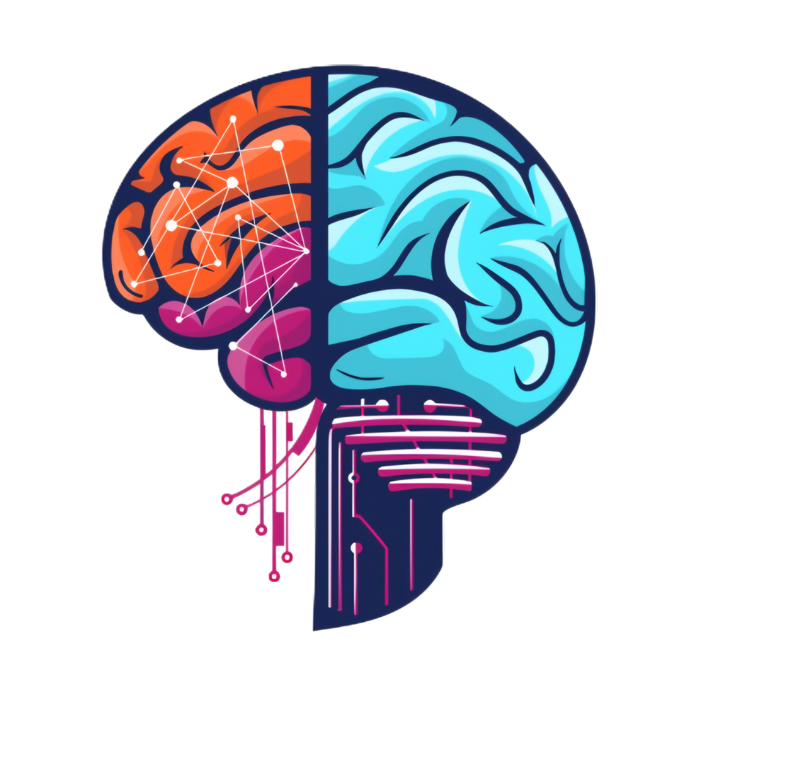

# 🎓 Eklavya - Modern Learning Management System

Welcome to Eklavya, a full-featured Learning Management System (LMS) built with cutting-edge technologies to provide an exceptional learning experience for students and teachers.



## ✨ Features & Functionality

### 👨‍🎓 For Students
- **📚 Course Discovery** - Browse and search for courses by category
- **💳 Course Enrollment** - Enroll in courses using Stripe payment integration (test mode)
- **📝 Course Progress Tracking** - Track completion progress for enrolled courses
- **🎯 Dashboard** - View in-progress and completed courses at a glance
- **📱 Responsive Design** - Seamless experience across all devices

### 👨‍🏫 For Teachers/Creators
- **🛠️ Course Creation** - Create and manage course content
- **📊 Analytics** - Track student engagement and progress
- **🎬 Rich Media** - Add videos, images, attachments, and text content
- **📑 Chapter Management** - Organize content into structured chapters
- **🔄 Publishing Controls** - Publish/unpublish courses and individual chapters

### 🧠 AI-Powered Examinations
- **📝 Assessment Creation** - Create assessments with various question types
- **🗣️ Accessibility Features** - Text-to-speech and speech recognition
- **🎭 Interactive UI** - Modern, animated user interface for engaging test experience
- **📈 Auto Grading** - Immediate scoring and feedback
- **🏅 Progress Tracking** - Monitor exam completion and scores

## 🛠️ Technologies & Tools

### Frontend
- **⚛️ React** - Component-based UI development
- **⏭️ Next.js 14** - React framework with App Router
- **🎨 TailwindCSS** - Utility-first CSS framework
- **🧩 Shadcn UI** - Reusable component system
- **✨ Framer Motion** - Advanced animations
- **🌈 GSAP** - Animation library for complex effects
- **🔍 TypeScript** - Type-safe JavaScript

### Backend
- **🔄 Next.js API Routes** - Serverless API endpoints
- **🗃️ Prisma** - Next-generation ORM for database access
- **📦 MySQL** - Relational database (via PlanetScale)
- **🔐 Clerk** - Authentication and user management
- **💰 Stripe** - Payment processing
- **☁️ Uploadthing** - File uploads and storage
- **🌐 Vercel** - Deployment and hosting

## 📋 Requirements

- Node.js 18+ 
- NPM or Yarn
- MySQL database (local or PlanetScaleEvien)

## 🚀 Getting Started

1. Clone the repository:
```bash
git clone https://github.com/Kunj-Mori/Eklavya-LMS.git
cd Eklavya-LMS
```

2. Install dependencies:
```bash
npm install
# or
yarn install
```

3. Set up environment variables:
```
# Create a .env file with the following variables
DATABASE_URL=
UPLOADTHING_SECRET=
UPLOADTHING_APP_ID=
CLERK_SECRET_KEY=
NEXT_PUBLIC_CLERK_PUBLISHABLE_KEY=
NEXT_PUBLIC_CLERK_SIGN_IN_URL=
NEXT_PUBLIC_CLERK_SIGN_UP_URL=
NEXT_PUBLIC_CLERK_AFTER_SIGN_IN_URL=
NEXT_PUBLIC_CLERK_AFTER_SIGN_UP_URL=
STRIPE_API_KEY=
STRIPE_WEBHOOK_SECRET=
NEXT_PUBLIC_APP_URL=
```

4. Set up the database schema:
```bash
npx prisma generate
npx prisma db push
```

5. Start the development server:
```bash
npm run dev
```

6. Open Prisma Studio to manage the database:
```bash
npx prisma studio
```

## 👩‍💻 User Roles

- **Student** - Can browse, enroll, and take courses
- **Teacher** - Can create and manage courses and assessments
- **Admin** - Has access to all features and user management

## 📄 License

[MIT License](LICENSE) - Feel free to use, modify, and distribute this project.

## 🙏 Acknowledgements

- Special thanks to all the open-source libraries and tools that made this project possible.
- Inspired by modern educational platforms and the need for accessible learning.

## 🤝 Contributing

Contributions are welcome! Please feel free to submit a Pull Request.

---

Built with ❤️ for the future of education 